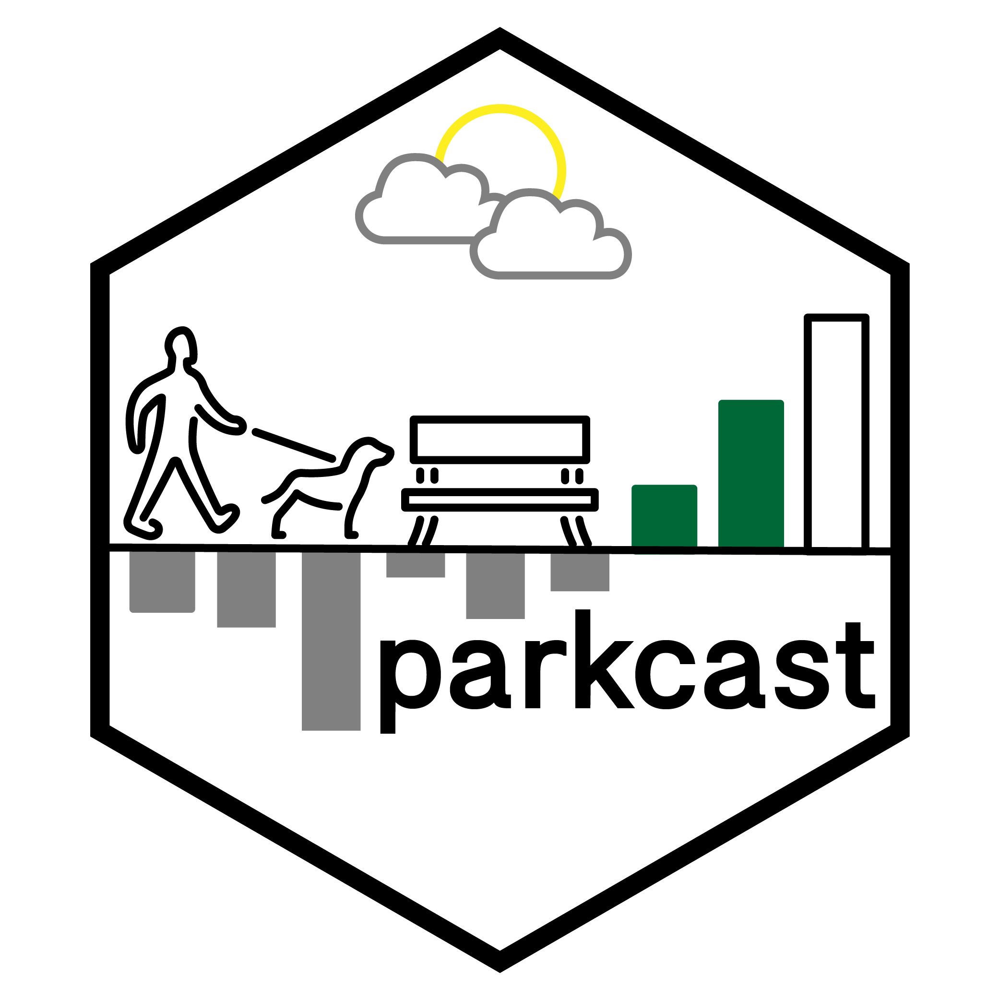

```{r setup, include=FALSE}
knitr::opts_chunk$set(echo = FALSE)

```




With the onset of COVID-19 in the UK, the importance of recreational park use was brought into sharp focus as one of very few recreational opportunities that was permissible during the initial lockdown period. On the one hand, this potentially presents opportunities for maintaining good health in otherwise isolated times. On the other, a lack of alternative recreational opportunities could mean that parks become busier hotspots for recreation and therefore present risks to the transmission of COVID-19. 

We have created an interactive app that allows the public to  visualise the risks and benefits of using parks over time and space. The app allows users to visualise and experimentally forecast how busy parks (including local parks, national parks, public beaches, marinas, dog parks, plazas, and public gardens) in their area will be over the next few days. The app visualises openly-available, aggregated and anonymised mobile device data from Google (https://www.google.com/covid19/mobility/) that tracks (with user’s consent) how many people are in parks each day in districts of England. Our key innovation is to:

1) Combine the Google park busyness data with Met Office weather data and UK Government data relating to park usage and access to green spaces

2) Build a random forest regression model to understand how weather, park usage and access to greenspace is related to park busyness (as defined by Google)

3) Use OpenWeather forecast data to forecast how busy parks will be in the future (next few days) - based on the weather and social science data, in an interactive app.

