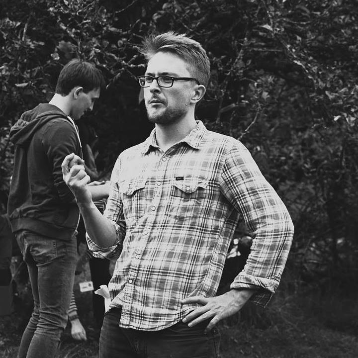
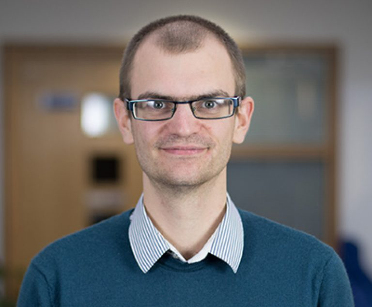
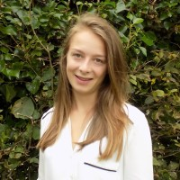
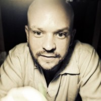
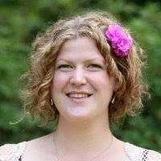
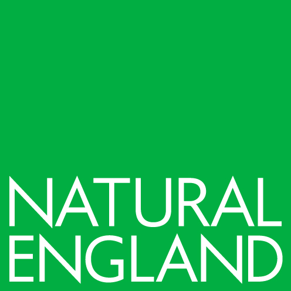
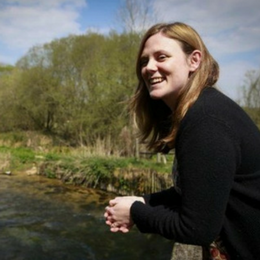

```{r setup, include=FALSE}
knitr::opts_chunk$set(echo = TRUE)
```

# Data curation

## Matt Jones 


## Scarlett Kynoch


Matt & Scarlett are based at the University of Exeter 

# Advisory

## Lewis Elliot



Lewis is based at the University of Exeter

# RShiny Development

## Anna Bush



Anna is based at the University of Exeter

## Matthew Grainger



Matt is based at the Norwegian Institute for Nature Research

# Natural England 

## Beth Brockett



## Katherine Burgess



## Rose O'Neil



Beth, Katherine and Rose are all based at Natural England